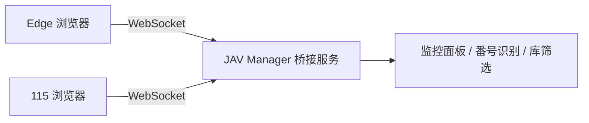

# JAV Manager

Windows 本地 JAV 影片管理工具：扫描已下载影片、识别番号、收藏与评分、快速筛选；并通过浏览器扩展实时监控 Edge / 115 当前页面。

## 分步开发计划

| 阶段 | 内容 | 状态 |
|------|------|------|
| **Phase 1** | 扫描库、番号识别、列表、收藏、评分、搜索筛选、打包 exe | ✅ |
| **Phase 1.5** | 浏览器扩展 + 桌面端 WebSocket 桥接，实时监控 Edge / 115 当前页 | ✅ |
| **Phase 1.6** | JavDB 列表页满屏网格、可配置每行贴纸数（详情页不变） | ✅ 当前 |
| **Phase 2** | 封面缩略图、演员/标签字段、按演员筛选 | 待做 |
| **Phase 3** | 重复文件检测、缺失番号批量重命名建议 | 待做 |
| **Phase 4** | 在线元数据补全（可选）、导出收藏清单 | 待做 |

## 浏览器监控（Phase 1.5）

桌面程序启动后会在本机开启 WebSocket 服务（默认端口 `17892`）。

1. 运行 JAV Manager，复制 **配对码**
2. 在 Edge / 115 中加载 `extension` 文件夹（详见 [extension/README.md](extension/README.md)）
3. 在扩展设置中粘贴配对码
4. 切换网页即可在桌面程序看到当前 URL，并自动识别番号、筛选本地库

架构示意：



## Phase 1 功能

- 添加一个或多个影片库文件夹
- 递归扫描常见视频格式（mp4 / mkv / avi 等）
- 从文件名自动识别番号（如 `SSIS-001`、`FC2-PPV-1234567`）
- 收藏（★）与 0–5 星评分
- 搜索番号、文件名、路径；筛选「只看收藏」「最低评分」
- 用系统默认播放器打开文件

数据保存在 `%USERPROFILE%\.jav-manager\`（配置 + SQLite 数据库 + 配对码）。

## 运行方式

### 开发运行

```bat
run.bat
```

### 打包成 exe

```bat
build.bat
```

生成：

- `dist\JAV Manager.exe`
- `dist\extension\`（浏览器扩展，需与 exe 一起分发）

### 打包给他人（便携版 ZIP，含依赖）

```bat
package-release.bat
```

生成：

- `release\JAV Manager-0.2.0-win64\` — 解压即用文件夹（exe + extension + 使用说明）
- `release\JAV Manager-0.2.0-win64.zip` — 可直接发给他人，**对方无需安装 Python**

## 下一步（Phase 2）

- 扩展与桌面端双向通信：网页一键加入收藏 / 标记已下载
- 封面缩略图、演员名解析
- 按演员、系列筛选

如需调整优先级，直接告诉我即可。
