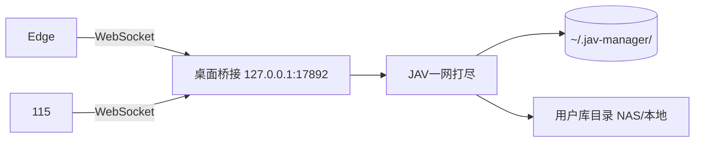

# JAV一网打尽

Windows 本地 JAV 影片管理工具，配合 Edge / 115 浏览器扩展，在 JavDB 上完成贴纸标记、磁链生成、收藏女优同步、库目录同步等操作。

> 个人配置与数据库保存在本机 `%USERPROFILE%\.jav-manager\`，不会随源码或 Release 包上传。

## 下载

前往 [Releases](https://github.com/huahuayo/JAV-roundupall/releases) 下载 **`JAV一网打尽-0.2.0-win64.zip`**，解压即用，无需安装 Python。

| 文件 | 说明 |
|------|------|
| `JAV一网打尽.exe` | 桌面程序 |
| `extension/` | 浏览器扩展（与 exe 同目录） |
| `Start.bat` | 快捷启动 |
| `USER_GUIDE.txt` | 便携版详细说明 |

## 快速开始

### 1. 桌面程序

1. 解压 ZIP 到任意目录
2. 双击 `JAV一网打尽.exe` 或 `Start.bat`
3. 在 **设置** 页配置各库目录（已下载 / 已破解 / 磁链已保存等）

### 2. 浏览器扩展

1. 保持桌面程序运行
2. Edge：`edge://extensions/` → 开发者模式 → **加载解压缩的扩展** → 选择解压目录内的 `extension` 文件夹
3. 115 浏览器：同样在扩展管理页加载同一 `extension` 文件夹
4. 打开 [javdb.com](https://javdb.com)，桌面程序弹出授权窗口时点 **是**
5. 扩展弹窗显示 **已连接** 即可（Edge 与 115 需分别授权）

扩展详细说明见 [extension/README.md](extension/README.md)。

## 主要功能

### 桌面端

- 多库目录扫描，自动识别番号（`SSIS-001`、`FC2-PPV-1234567` 等）
- 收藏、评分、搜索与筛选
- 同步任务：待下载女优、磁链已保存、影片已下载、**影片已破解**、元数据同步、待整理视频
- 每女优文件夹 `目录.txt` 记录同步进度（元数据 / 封面 / JavDB）
- 115 网盘备份等工具页

### 浏览器扩展（JavDB）

- 列表页贴纸：已鉴定 / 已下载 / 已屏蔽 / 生成 TXT / 保存 115
- 列表页满屏网格、可配置每行贴纸数
- 磁链筛选规则、收藏女优同步、详情页增强

## 架构



## 从源码运行（开发者）

**环境：** Windows 10/11，Python 3.10+

```bat
git clone https://github.com/huahuayo/JAV-roundupall.git
cd JAV-roundupall
run.bat
```

或手动：

```bat
python -m venv .venv
.venv\Scripts\activate
pip install -r requirements.txt
python main.py
```

### 打包

```bat
build.bat              rem 生成 dist\JAV一网打尽.exe + dist\extension
package-release.bat    rem 生成 release\JAV一网打尽-0.2.0-win64.zip
```

Release 包会自动校验，确保不含个人路径、config、数据库。

## 数据与隐私

| 位置 | 内容 |
|------|------|
| `%USERPROFILE%\.jav-manager\` | 配置、状态库、配对 token |
| 用户设置的库目录 | 影片文件、`目录.txt`、同步日志 |

**请勿**将 `.jav-manager`、项目根目录下的个人 txt 导出文件、或含 UNC/用户名路径的配置提交到 GitHub。

## 常见问题

**扩展显示未连接**

- 确认桌面程序已启动
- 在 JavDB 页触发连接，并在桌面点「是」授权
- Edge 与 115 连接状态独立，需分别授权

**同步任务无法开始**

- 检查设置页库路径是否有效
- 已破解/元数据同步需 Edge 扩展已连接

**Git push 失败**

- 国内网络需配置代理，或使用 GitHub Desktop

## 版本

- 桌面程序：**0.2.0**
- 浏览器扩展：**2.4.24**

## 许可证

暂未指定开源许可证；如需二次分发请先联系仓库作者。
